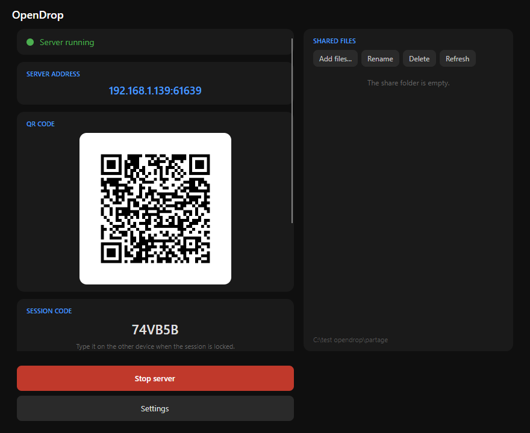
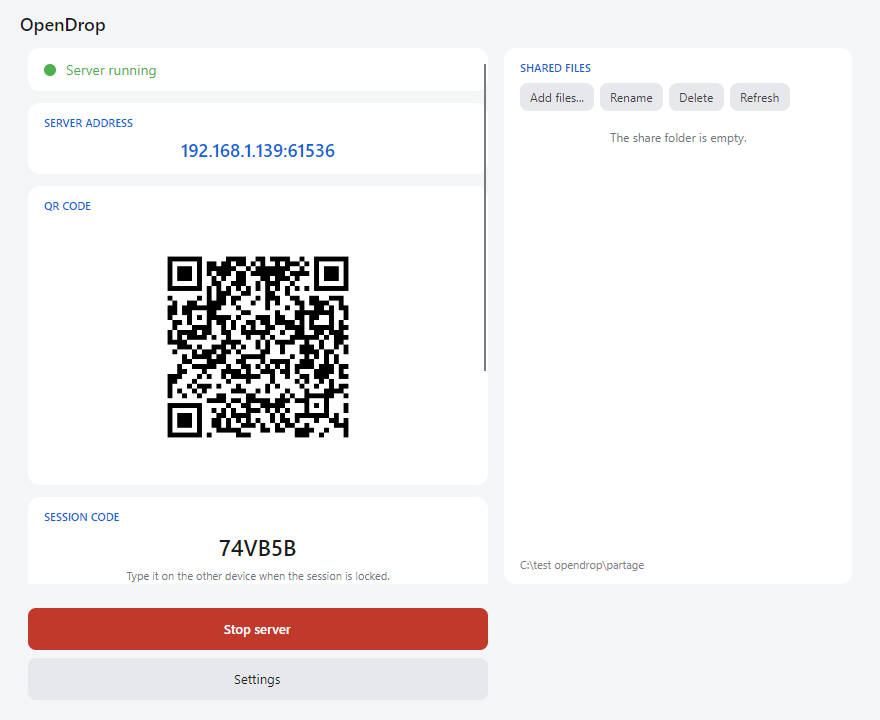
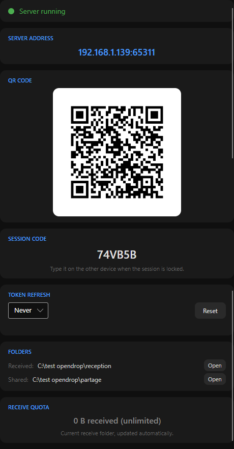
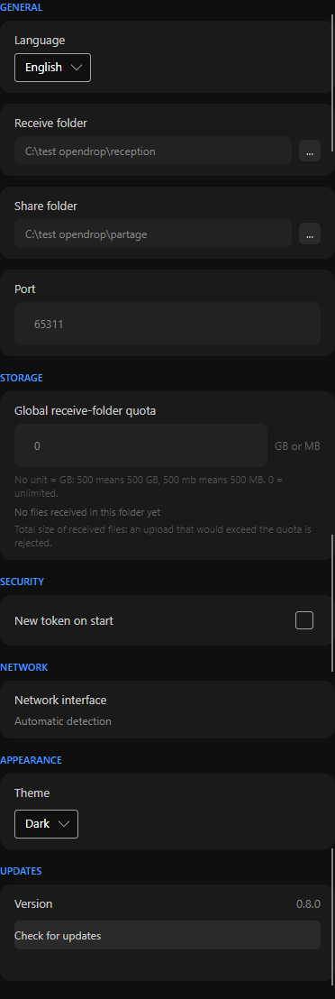
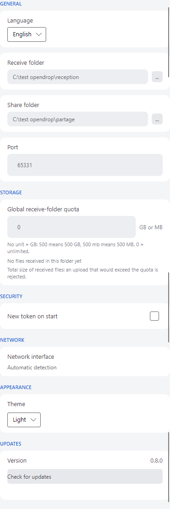
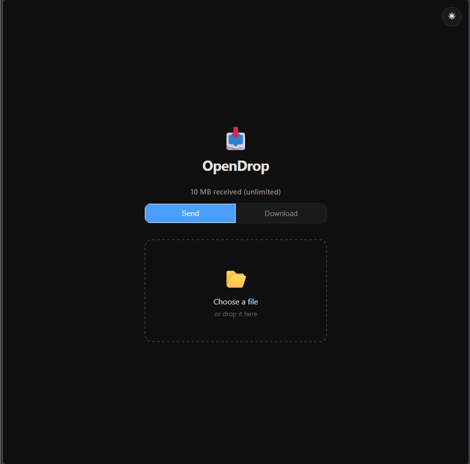
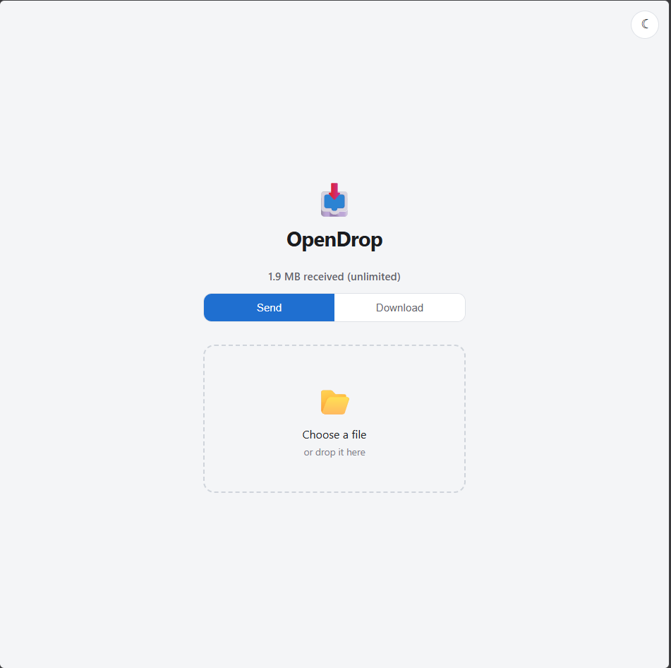
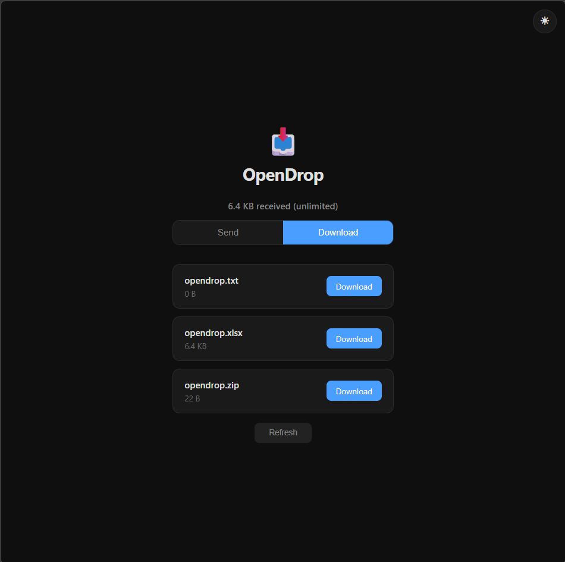
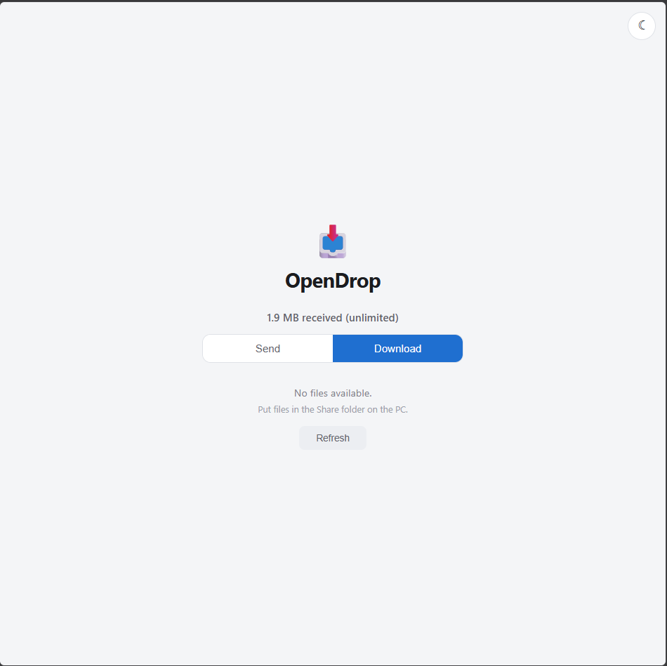

# OpenDrop

> Direct file transfers on your local network: launch OpenDrop, scan the
> QR code, send. No account, no cloud, no install on your phone.

[](https://github.com/lucas31Zz/opendrop/actions/workflows/tests.yml)
[](https://github.com/lucas31Zz/opendrop/releases/latest)
[](LICENSE)
[](pyproject.toml)
[](desktop/OpenDrop/OpenDrop.csproj)
[](.github/workflows/tests.yml)


```text
PC (OpenDrop)  --->  QR CODE  --->  phone / tablet / another PC
                     |                    |
                  6-character code        v
                                    web interface (HTTPS)
                                             |
                                    Send / Download
                                             |
                                    direct transfer
                                        over the LAN
```

The file never leaves your local network: OpenDrop is a peer-to-peer HTTP(S)
server running on your machine, nothing goes over the internet.

---

## What it does

- **HTTPS required**: self-signed certificate generated on first launch
- **Token-based sessions**: 32 random characters, configurable expiration,
  manual rotation (Reset button) or automatic (timer), plus a 6-character
  backup code to unlock a device
- **Web interface** in the browser, no install needed: *Send* and
  *Download* tabs, quota bar up top, session lock
- **Share folder**: files dropped in there are offered to other devices,
  downloadable in one click
- **Global receive quota** (optional): rejected with a 507 before anything
  is written, live indicator (green under the limit, red once reached)
- **Safety limits**: 10 GB per file, per-IP rate limits, sanitized file
  names, validated paths, no server path leaks
- **Desktop app for Windows and Linux** (Avalonia, .NET 8): QR code,
  address, session code, quota, folders, settings, one-click server
  start/stop
- **English and French**: English is the default everywhere (installer,
  desktop app, web interface, server messages); switch the app to French
  in *Settings* (or pick it in the Windows installer)
- **Light or dark**: one theme switch in *Settings* covers the desktop
  window, the dialogs and the phone page; the web interface follows it and
  keeps its own ☀/☾ button for this device

---

## Screenshots

### Desktop app

The main window: QR code, server address, session code, receive quota,
folders, and the Start/Stop/Settings buttons along the bottom.



The same window in the light theme (*Settings > Appearance*):



The left column scrolls; here it is from top to bottom (QR code, address,
session code, token refresh, folders, quota):



### Settings

Configure folders, port, storage quota, token rotation, appearance
(light/dark) and language. The form scrolls, so here it is from top to
bottom, in both themes:

| Dark | Light |
|---|---|
|  |  |

### Web interface

Send files and download from the Share folder directly in your browser —
no install needed, in the same light/dark theme as the app.

**Send tab:**

| Dark | Light |
|---|---|
|  |  |

**Download tab:**

| Dark | Light |
|---|---|
|  |  |

---

## Requirements

- Python **3.10+** (developed and tested on 3.12) — Windows **or Linux**
  (tests run in CI on both)
- Only needed to build the desktop app from source: **.NET 8 SDK**
  (available on Windows, Linux, and macOS)

Python dependencies:

```powershell
pip install -e .            # qrcode[pil] + cryptography, installs the "opendrop" command
```

---

## Downloads

Every GitHub release (the *Releases* tab) includes, generated automatically
on each tag (`v0.2.0` onwards - `v0.1.0` predates the release workflow and
ships no file):

| File | Platform | Contents |
|---|---|---|
| `OpenDrop-vX.Y.Z-win-x64-setup.exe` | Windows 10/11 x64 | full installer (admin rights), dependencies installed locally, offline |
| `OpenDrop-vX.Y.Z-win-x64.zip` | Windows 10/11 x64 | portable version (just unzip) |
| `OpenDrop-vX.Y.Z-linux-x64.tar.gz` | Linux x64 (Debian, Kali, Ubuntu...) | binary + server + wheels + install scripts |

### Windows: installer

1. Download the `*-win-x64-setup.exe` and run it (admin rights required).
2. Choose the installer language, the application language (English or
   French, English by default), then confirm the install into
   `C:\Program Files (x86)\OpenDrop`.
3. Python **3.10+** must already be present (check *Add python.exe to
   PATH*): the installer sets up the dependencies in a local `venv` from
   the bundled wheels, with no network access.

Uninstall: *Windows Settings > Apps > OpenDrop* (or `uninstall.exe` in the
install folder). The uninstaller removes the app, its `venv`, and the app
data (`config.json`, `session.json`, `server.pid`, `certs\` in
`%LOCALAPPDATA%\OpenDrop`) but **never touches your receive or share
folders** (received and shared files are left exactly as they are).

### Linux: tarball

Requirements: `sudo apt install python3 python3-venv` (Python 3.10+).

```bash
tar -xzf OpenDrop-vX.Y.Z-linux-x64.tar.gz
cd OpenDrop
sudo ./install.sh          # /opt/opendrop + local venv + app menu
opendrop-desktop           # or from the menu
```

Uninstall (keeps your *Received* and *Shared* folders):

```bash
sudo ./uninstall.sh
```

`install.sh` writes to `/opt/opendrop` (app) and `~/.opendrop/` (data);
received and shared files themselves stay in `~/Downloads/OpenDrop`.

### Portable version

Unzip the archive and run `OpenDrop.exe` (Windows) or `./OpenDrop` (Linux).
The app needs Python 3.10+ and the dependencies:

```powershell
pip install -r requirements.txt     # or reuse the venv from an install
```

### Automatic updates

OpenDrop checks the latest GitHub release when it starts and whenever you
ask it to from *Settings > Updates*. Only releases tagged `vX.Y.Z` are
offered, never a draft or a pre-release, and nothing is installed before
you click *Update now*.

- **Windows**: the `setup.exe` is downloaded, checked against the SHA-256
  digest published with the asset, and run silently once OpenDrop has
  closed. It replaces the previous installation in place — a single entry
  in *Apps*, your settings kept.
- **Linux**: the archive is verified the same way. Installed in `/opt`?
  A polkit password dialog (`pkexec`) runs the bundled `install.sh`;
  running from an unpacked folder? The files are replaced in place.
  `~/.opendrop` and your receive/share folders are never touched.

*Skip this version* is remembered for that release only.

---

## Getting started

### 1. Desktop app (Windows and Linux)

The same app runs on both systems (Avalonia UI).

**From source:**

```powershell
dotnet build desktop\OpenDrop\OpenDrop.csproj
.\desktop\OpenDrop\bin\Debug\net8.0-windows\OpenDrop.exe    # Windows
```

```bash
dotnet build desktop/OpenDrop/OpenDrop.csproj
./desktop/OpenDrop/bin/Debug/net8.0/OpenDrop            # Linux
```

**From a release**: see *Downloads* above (Windows installer, Linux tarball,
or portable archive).

The app starts the server on its own: the status card flips to **Server
running**, the address shows up, and the QR code and session code are
generated. Buttons along the bottom:

- **Start server / Stop server**
- **Settings** (folders, port, quota, new token on start, language
  English/French, theme light/dark): once saved, the server restarts
  itself with the new config; the language and theme switches apply
  immediately

### 2. Server only (no desktop UI)

Works on Windows, Linux, and macOS:

```powershell
opendrop                      # after pip install -e .
# or
$env:PYTHONPATH = "src"; python -m opendrop.main
```

Useful options:

| Option | Effect |
|---|---|
| `--headless` | no QR window or browser (for GUI/automated use) |
| `--port 9090` | forces a port other than `preferred_port` |
| `--rotate-token` | forces a new token and a new session code |

### 3. Linux (no desktop available)

On a machine or a VM (Kali, Ubuntu, etc.):

```bash
git clone https://github.com/lucas31Zz/opendrop.git
cd opendrop
pip install -e .
opendrop
```

The terminal prints the `https://<ip>:<port>` address, the session code, and
the path of the QR code; the PNG opens on its own with `xdg-open` if a
desktop is present, otherwise open the URL by hand in your browser.

- No display (SSH, server): `opendrop --headless` prints a JSON line
  (`ip`, `port`, `token`, `session_code`, `url_upload`) for scripts.
- If your phone won't connect, check the firewall:
  `sudo ufw allow 8080` (or whichever port you're using).
- The desktop app runs on Linux too (same binary as the server, see
  *1. Desktop app*): QR code, quota, settings.

---

## Using it from a phone

1. Note the `https://<ip>:<port>` address shown by the app.
2. Scan the **QR code** (or type the URL with `?token=...`).
3. On first visit the browser shows a self-signed certificate warning:
   accept the one from the OpenDrop machine only (step-by-step in
   [SECURITY.md](SECURITY.md)).
4. If the screen says **Session locked**, type the **6-character code**
   shown in the desktop app.
5. Use the **Send** tab to send a file, the **Download** tab to grab the
   ones in the *Share* folder.

The top line shows `usage / quota` and updates on its own (every 5 s, and
after each send). Green: under the limit. Red: quota reached.

---

## Folders and quota

| Folder | Role |
|---|---|
| **Receive folder** | where received files land (PC side) |
| **Share folder** | files offered to other devices (PC side) |

Both are changed in **Settings** (browse + Save).

**Global receive quota** (Settings > Storage):

- `0` = unlimited (the default)
- no unit means GB: `500` counts as 500 GB; with a unit: `500 mb`,
  `0.5 gb`, `10.75` (comma or period, French-style `500 mo` / `0,5 go`
  also accepted)
- an unreadable value is rejected with an error message, never silently
  ignored; a negative value in `config.json` is reset to 0 (unlimited)
- above 20% of the disk's free space, a warning asks you to confirm before
  saving
- a send that would push past the quota is rejected with **507** before
  anything is written; two sends at the same time can't both slip under the
  limit
- the indicator also shows up in the main window, refreshed every 3 s
  without a restart

---

## Configuration files

| File | Contents |
|---|---|
| `%LOCALAPPDATA%\OpenDrop\config.json` | folders, port, quota, options |
| `%LOCALAPPDATA%\OpenDrop\session.json` | current token + session code |
| `%LOCALAPPDATA%\OpenDrop\certs\server.crt` / `server.key` | self-signed TLS certificate (EC P-256, 397 days) |

On Linux/macOS the same folder is `~/.opendrop/` (the receive and share
folders, though, stay in `~/Downloads/OpenDrop`).

`config.json` keys:

| Key | Default | Meaning |
|---|---|---|
| `download_directory` | `%USERPROFILE%\Downloads\OpenDrop` | receive folder |
| `share_directory` | `%USERPROFILE%\Downloads\OpenDrop\Partage` | share folder |
| `preferred_port` | `8080` | requested port (falls back to a free one if it's taken) |
| `session_expires_in` | `3600` | token lifetime, in seconds |
| `global_quota_bytes` | `0` | total receive-folder quota, in bytes |
| `generate_new_token` | `false` | new token on every launch |
| `trust_proxy` | `false` | trust `X-Forwarded-For` (known proxies only) |
| `language` | `en` | interface language: server messages, web UI and desktop app (`en` or `fr`) |
| `theme` | `dark` | desktop and web appearance (`light` or `dark`) |

To regenerate the certificate: quit OpenDrop, delete the
`%LOCALAPPDATA%\OpenDrop\certs\` folder, relaunch (see SECURITY.md).

---

## Troubleshooting

| Symptom | What to do |
|---|---|
| The phone won't open the address | Same Wi-Fi/network as the PC, no guest network (they are usually isolated); then allow the port through the firewall: `sudo ufw allow 8080` (Linux). Re-scan the QR code: the address changes when the PC's IP or port changes |
| The browser says *Not secure* / certificate warning | Expected: the certificate is self-signed. Continue to the OpenDrop address only, never another site. To start fresh, delete `certs\` (see above) |
| *Session locked* on the phone | Type the 6-character code shown in the desktop app. The code rotates when the token does |
| *Port already in use* at start | An older server is still running: stop it (Stop server, or close the app), then start again. Otherwise OpenDrop moves to the next free port automatically |
| Upload rejected with **507** (quota bar red) | The receive folder is full against the quota: raise it or set `0` (unlimited) in *Settings > Storage* |
| *File too large (max 10 GB)* | Hard cap per file; split the file |
| No update is offered | Only releases tagged `vX.Y.Z` are offered (never a draft or pre-release), GitHub must be reachable, and *Skip this version* silences that version only |
| A second window opens instead of the running one | The single-instance signal failed; the second instance runs anyway as a fallback. Close one of them |
| The QR code never opens | Open the printed `https://<ip>:<port>` URL by hand (`xdg-open`/`startfile` may be missing) |
| The installer says Python is missing | Install Python 3.10+ from python.org, check *Add python.exe to PATH*, run the setup again |
| A file you expected is not listed | The *Download* tab lists the **Share** folder only: drop the file into it (or use *Add* in the desktop app) |

---

## FAQ

**Do I need an account or the internet?**
No. OpenDrop is a local HTTP(S) server on your PC; the transfer stays on
your LAN, nothing is uploaded anywhere.

**Does my phone need an app?**
No. Scan the QR code and use the browser.

**Does it work over the internet?**
No, by design: everything is bound to your local network. Do not expose
the port to the internet.

**Is it encrypted?**
Traffic is HTTPS with a self-signed certificate. Files on disk are *not*
encrypted - see [SECURITY.md](SECURITY.md) and *Security* above.

**How long does a session last?**
`session_expires_in` seconds (3600 by default). The token can also be
rotated on demand (Reset / `--rotate-token`) or on every launch.

**Where do files go?**
Received files land in the *Receive folder*, files to share are read from
the *Share folder*. Both are changed in *Settings*.

**How large can a file be?**
10 GB per file, plus the optional global receive quota.

**Can I run it on macOS?**
The server only (`opendrop`): the desktop app targets Windows and Linux.

**How do I update?**
*Settings > Updates* (or automatically at start); the app downloads the
release, checks its SHA-256, and installs it after it closes. See
*Automatic updates* above.

**How do I run it without a window (scripts, VM)?**
`opendrop --headless` prints a JSON line with the URL, token and session
code.

---

## Known limitations

- **LAN only**: no discovery across networks, no internet mode, no NAT
  traversal.
- **No encryption at rest**, and the transfer SHA-256 is not compared
  automatically (*Security* above).
- **The token lives in the URL**: it can end up in your browser history;
  anyone holding the token or the session code can send and receive.
- **One file per request** in the web interface, and the phone's file list
  refreshes manually (*Refresh* button).
- **Phone to phone**: a phone can send to the PC, but the *Download* tab
  only offers the *Share* folder, so one phone cannot pull what another
  phone just sent.
- **A cancelled or interrupted update** leaves a partial file in
  `%TEMP%\opendrop-update` until the next attempt reuses or drops it.
- **No transfer resume**: an interrupted upload or download must be started
  again.
- **Windows installer**: Python 3.10+ must already be installed (the
  installer only ships the wheels).
- **10 GB per file** and per-IP rate limits (5 unlock attempts/minute).

---

## Tests

Homegrown test suites (no external framework), run from the repo root:

```powershell
python -m tests.test_security     # 36/36 - tokens, paths, limits, origin, writes, logs
python -m tests.test_routes       # 44/44 - route truth table
python -m tests.test_paths        # 43/43 - no absolute paths in responses
python -m tests.test_quota        # 40/40 - quota, simultaneous reservations, 507
python -m tests.test_sessions     # 34/34 - sessions, expiration, code rotation
python -m tests.test_tls          # 15/15 - self-signed certificate, forced HTTPS
python -m tests.test_server       # 14/14 - general routes, port in use, TIME_WAIT probe
python -m tests.test_beta         # 64/64 - full run-through
python -m tests.test_beta --large # 76/76 - file batches, traversal attempts
```

Before building, close the desktop app: a running binary blocks
`dotnet build`.

The same suites (without `--large`) run in continuous integration on
Windows and Linux, Python 3.10 and 3.12.

---

## Security

The full threat model (routes, tokens, quota, certificate, limits) is
documented in [SECURITY.md](SECURITY.md). In short:

- everything goes over HTTPS, with a self-signed certificate you have to
  accept by hand;
- the token lives in the URL: it can end up in your browser history; the
  server logs, meanwhile, print `token=***` and `code=***`;
- no encryption at rest: whatever lands on disk is stored in plain text;
  the SHA-256 handed back to the sender isn't compared automatically;
- anyone holding the token or the session code can send/receive.

---

## Repository layout

| Folder | Role |
|---|---|
| `src/opendrop/` | Python server (HTTPS, routes, sessions, quota, TLS) |
| `desktop/OpenDrop/` | Avalonia desktop app (.NET 8, Windows + Linux) that drives the server |
| `web/` | web interface (`index.html`, `app.js`, `style.css`) |
| `packaging/` | Windows installer (Inno Setup) and Linux scripts (install/uninstall) |
| `tools/` | dev utilities (icon generation); `tools/screenshots/` is local-only and gitignored |
| `tests/` | homegrown test suites |
| `docs/` | project docs (screenshots) |
| `.github/` | continuous integration, Dependabot, issue templates |
| `SECURITY.md` | threat model |
| `CONTRIBUTING.md` | how to contribute |
| `LICENSE` | MIT license |

### How the pieces talk to each other

```text
                       starts / stops (process, pid file)
 desktop app  ────────────────────────────────────────────►  python -m opendrop.main --headless
 (Avalonia)    ◄──── polls https://127.0.0.1:<port>/api/info ────┐
       │                                                        │
       │ GET /releases/latest (update check)                    │ HTTPS + token
       ▼                                                        ▼
   GitHub Releases ◄─── SHA-256 of asset ──── UpdateService   phone browser
   (setup.exe/tar.gz)                          UpdateRunner   (web interface)
```

| Component | Role |
|---|---|
| `src/opendrop/main.py` | entry point: config, IP/port, token, QR, headless JSON |
| `src/opendrop/server/` | HTTPS server: routes (`server.py`), multipart parsing (`multipart.py`), quota (`quota.py`), sessions (`session.py`), rate limits (`rate_limit.py`), typed errors (`errors.py`) |
| `src/opendrop/security/` | tokens, session state, path/file-name validation, TLS certificate |
| `src/opendrop/config/`, `network/`, `qr/`, `i18n.py` | configuration, local IP and free port, QR rendering, translations |
| `web/` | the phone UI: one `fetch` per API route (`/api/info`, `/api/upload`, `/api/files`, `/api/quota`, `/api/download/<name>`, `/api/session/unlock`); `/api/progress` exists server-side but no client calls it yet |
| `desktop/OpenDrop/Services/ServerManager.cs` | spawns and supervises the Python server, resolves the interpreter (installer `venv` first, then PATH), kills the tree on exit |
| `desktop/OpenDrop/Services/UpdateService.cs` | queries `api.github.com/.../releases/latest`, accepts only `vX.Y.Z`, verifies the published `sha256:` digest |
| `desktop/OpenDrop/Services/UpdateRunner.cs` | downloads, then runs the installer (`/VERYSILENT`) or `install.sh` after the app has exited |
| `.github/workflows/` | `tests.yml` (suites), `desktop.yml` (build), `release.yml` (assets attached to the release on a `v*` tag) |

The desktop app never parses the server's stdout: it reads the running
configuration back through `/api/info` (address, port, quota, language,
theme). Everything else the UI shows comes from the same API the phone
uses.

---

## Release process

Maintainers only; contributors never need this.

1. **Choose the version** (semantic): patch for fixes, minor for features,
   major for breaking changes.
2. **Bump it in four files** so they all agree — `pyproject.toml`,
   `packaging/windows/OpenDrop.iss`, `src/opendrop/main.py`,
   `desktop/OpenDrop/OpenDrop.csproj` (the `.iss` comment on line 13 too).
3. **Update `CHANGELOG.md`**: new `## [X.Y.Z] - YYYY-MM-DD` section at the
   top, following Keep a Changelog.
4. **Run everything** (all suites, `--large`, `dotnet build`) — CI must be
   green on the commit you tag.
5. **Tag and push**:

   ```powershell
   git tag -a vX.Y.Z -m "OpenDrop vX.Y.Z"
   git push origin main vX.Y.Z
   ```

   The `v` prefix is mandatory: the desktop app only offers releases whose
   tag matches `vX.Y.Z`.
6. **The `release` workflow does the rest**: on every `v*` tag it builds
   the Windows setup + portable zip and the Linux tarball, creates the
   release (title + generated notes) if it does not exist, and attaches
   the three assets with `--clobber`. Nothing is pushed by hand.
7. **Verify**: the three assets are present, digest published, tests
   badge green, and *Latest* points at the new tag.

Rolling back or re-releasing: never move a published tag — publish a new
patch release instead. To repair assets, re-run the workflow (`gh run
rerun`) or let the next tag recreate them; a release created without
assets can be deleted and rebuilt by re-running the tag's workflow.

---

## Contributing

Fixes and features are welcome: see
[CONTRIBUTING.md](CONTRIBUTING.md). The test suites also run in continuous
integration (GitHub Actions) on every push and pull request.

Found a vulnerability? Use the repo's *Security* tab or the e-mail listed in
[SECURITY.md](SECURITY.md) - no public issues.

Expected behavior in the community: [CODE_OF_CONDUCT.md](CODE_OF_CONDUCT.md).

---

## License

Distributed under the [MIT](LICENSE) license. Use it at your own risk.
Version history: [CHANGELOG.md](CHANGELOG.md).
